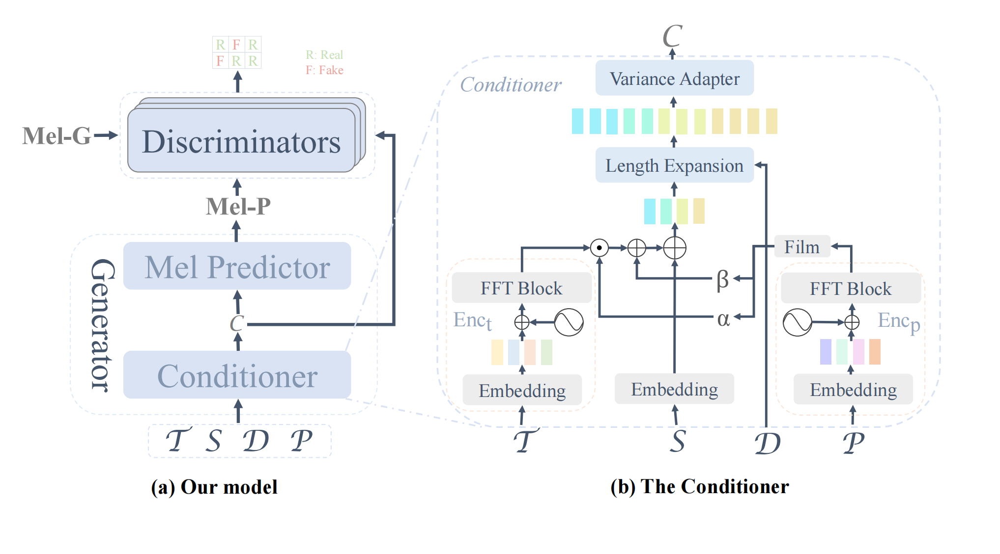

# Gezi Opera Synthesis
The official implementation of our AAAI submission *FT-GAN: Fine-grained Tune Modeling for Chinese Opera Synthesis*, which is under double-blind review.

## :card_file_box: Environments and Dataset
1. Create an environment with anaconda for example:
```bash
conda create -n gezi_opera python=3.8
conda activate gezi_opera
git clone https://github.com/double-blind-pseudo-user/Gezi_opera_synthesis
cd Gezi_opera_synthesis
pip install -r requirements.txt
```
2. Download the pretrained [vocoder](https://github.com/MoonInTheRiver/DiffSinger/releases/download/pretrain-model/model_ckpt_steps_1512000.ckpt) and the [pitch extractor](https://github.com/MoonInTheRiver/DiffSinger/releases/download/pretrain-model/0102_xiaoma_pe.zip), unzip these two files into `checkpoints` before training your acoustic model.
1. Download the [dataset](https://github.com/double-blind-pseudo-user/Gezi_opera_synthesis/releases/download/assets/GOAT.zip) and unzip it into `data/processed`.

## :page_facing_up: Preprocessing
Run the following scripts to binarize the data:
```shell
export PYTHONPATH=.
CUDA_VISIBLE_DEVICES=0 nohup python data_gen/tts/bin/binarize.py \
--config usr/configs/gezixi.yaml \
> data_processing.log 2>&1 &
```
The binarized data will be saved to `data/binary`.

## :pencil2: Training
Run the following scripts to train the model:
```shell
CUDA_VISIBLE_DEVICES=0 nohup python tasks/run.py \
--config usr/configs/gezixi.yaml --exp_name your_experiments_name --reset \
> training.log 2>&1 &
```
## :loud_sound: Inference
When training is done, run the following scripts to generate audio:
```shell
CUDA_VISIBLE_DEVICES=0 nohup python tasks/run.py \
--config usr/configs/gezixi.yaml --exp_name your_experiment_name --reset --infer \
> inference.log 2>&1 &
```
Inference results will be saved in `checkpoints/your_experiment_name/generated_` by default.
